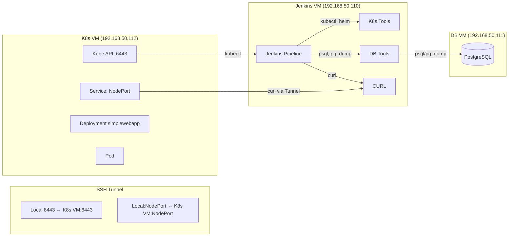

# 🚀 Jenkins - Kubernetes Mock App Upgrade Pipeline

Automated **CI/CD upgrade pipeline** for a mock web app (**SimpleWebApp**) on Kubernetes with a **PostgreSQL backend**.  
This project demonstrates:
- ✅ Health checks
- 💾 Database backup & schema upgrade
- ⎈ Helm-based application deployment
- 📦 Artifact archiving

---

## 🏗️ Architecture Overview



---

## 📋 Prerequisites

You need **3 Virtual Machines**:

1. **Jenkins VM** 🧩
   - Jenkins controller/agent with label `jenkins-vm`
   - Installed tools: `kubectl`, `helm`, `psql`, `pg_dump`, `curl`

2. **Kubernetes VM** ⎈
   - Minikube cluster with **1 control-plane** + **1 worker node**
   - CNI installed (e.g., **Flannel**)

3. **PostgreSQL VM** 🗄️
   - PostgreSQL server configured to allow connections from Jenkins VM IP

4. **Networking** 🌐
   - All VMs must be on the same network segment

---

## ⚡ Quick Start

### 1️⃣ Environment Setup
Follow the detailed guide in `docs/ENVIRONMENT_SETUP.md` to:
- Prepare your VMs
- Deploy the **initial v1.0 state**

---

### 2️⃣ Repository Setup
```bash
git clone https://github.com/fahimtq1/jenkins-k8s-helm-demo.git
cd jenkins-k8s-helm-demo
```

---

### 3️⃣ Configure Jenkins

🔑 **Create Credential**
- **Kind:** Secret text  
- **ID:** `test-db-password`  
- **Secret:** `testpass`

📦 **Create Pipeline Job**
- New Item → **Pipeline**
- **Name:** `app-upgrade-pipeline`
- **Definition:** Pipeline script from SCM
- **SCM:** Git
- **Repository URL:** Your fork's URL
- **Script Path:** `Jenkinsfile`
- Save ✅

---

### 4️⃣ Run the Pipeline
1. Open the job → Click **Build with Parameters**
2. Verify parameters (**IPs, paths**) match your environment
3. Click **Build** ▶️

---

## 🔄 Pipeline Stages

1. **Prepare Environment** 📂
   - Creates directory structure for backups & health checks

2. **Pre-Flight** 🩺
   - Runs health check on **v1.0 app**
   - Takes `pg_dump` backup of DB

3. **Apply DB Schema** 🗄️
   - Executes `v2.0_upgrade.sql` to upgrade DB schema

4. **Helm Upgrade** ⎈
   - Deploys **v2.0 Helm chart**
   - Waits for rollout to complete

5. **Mock DTA Upgrade** 🔄
   - Runs mock script simulating **3rd-party integration update**

6. **Post-Upgrade Health Check** ✅
   - Verifies **v2.0 app** is healthy & serving correct content

---

## 📁 Directory Layout

```text
jenkins-k8s-mockapp/
├── Jenkinsfile                 # Main pipeline definition
├── README.md                   # This file
├── .gitignore                  # Git ignore rules
├── scripts/
│   ├── setup_tunnel.sh         # Establish SSH tunnels (API + NodePort)
│   ├── check_nodeport.sh       # Find a Service's NodePort
│   └── verify_connectivity.sh  # Sanity-check tunnel & service reachability
├── docs/
│   ├── ENVIRONMENT_SETUP.md    # Detailed VM setup guide
│   ├── TROUBLESHOOTING.md      # Common issues & resolutions
│   ├── ARCHITECTURE.md         # Architecture walkthrough & diagrams
│   └── LINKEDIN_POST.md        # Prewritten LinkedIn post to share your build
├── sql/
│   └── v2.0_upgrade.sql        # Database schema upgrade script
└── helm/
    └── simplewebapp-chart-v2.0/
        ├── Chart.yaml
        ├── values.yaml
        └── templates/
            ├── deployment.yaml
            ├── service.yaml
            ├── configmap.yaml
            └── _helpers.tpl
```

---

## 🧰 Key Technologies & Tools

| Tech / Tool               | Purpose                                                             | You’ll Touch It In                     |
|---------------------------|---------------------------------------------------------------------|----------------------------------------|
| **Jenkins**               | CI/CD orchestration (Pipeline-as-Code) for app + DB upgrade flow   | `Jenkinsfile`                          |
| **Kubernetes (Minikube)** | Local two-node cluster (control plane + worker) to deploy the app  | `helm/`                                |
| **Helm**                  | Declarative packaging & upgrades of the SimpleWebApp               | `helm/simplewebapp-chart-v2.0`         |
| **PostgreSQL**            | Application database with schema migration to v2.0                 | `sql/v2.0_upgrade.sql`                 |
| **SSH Tunneling**         | Secure bridge to API server & NodePort services                    | `scripts/setup_tunnel.sh`              |
| **Bash Scripting**        | Automation glue: discovery, checks, health probes                  | `scripts/`                             |

> Tip: This repo is intentionally minimal yet production-flavored—ideal for demos, interviews, and internal knowledge sharing.

---

## ⚙️ Scripts at a Glance

- `scripts/setup_tunnel.sh` — Creates **local↔remote** SSH tunnels to the K8s API (`:6443`) and to your app’s **NodePort**.
- `scripts/check_nodeport.sh` — Prints the **NodePort** for the service so you can `curl` it through the tunnel.
- `scripts/verify_connectivity.sh` — Quick **sanity checks** to confirm API reachability and service health.

---

## 📚 Documentation Map

- **Environment Setup:** step-by-step provisioning of Jenkins, K8s, and PostgreSQL  
  → `docs/ENVIRONMENT_SETUP.md`
- **Architecture & Diagrams:** full context of traffic flows and components  
  → `docs/ARCHITECTURE.md`
- **Troubleshooting:** common pitfalls (Pending Pods, failing probes, tunnel issues)  
  → `docs/TROUBLESHOOTING.md`
- **Share Your Build:** ready-to-post social blurb  
  → `docs/LINKEDIN_POST.md`

---

## 🧪 What You’ll Learn

- Orchestrate **pre-flight health checks** and **DB backups** in a Jenkins pipeline
- Apply **schema migrations** safely before rolling out app **v2.0**
- Perform an **atomic Helm upgrade** with rollout verification
- Archive build artifacts and **capture evidence** of post-upgrade health

---

## 🛟 Troubleshooting (Quick Peek)

If something feels off, start here 👇 — the most common issues are well-documented.

- **Pod Pending / ImagePullBackOff:** check node resources, image repo, and pull secrets.
- **Readiness/Liveness probe failures:** ensure the endpoint path and port match `values.yaml`.
- **Connectivity via tunnel:** re-run `setup_tunnel.sh`, then `verify_connectivity.sh`.

➡️ Full guide: `docs/TROUBLESHOOTING.md`
