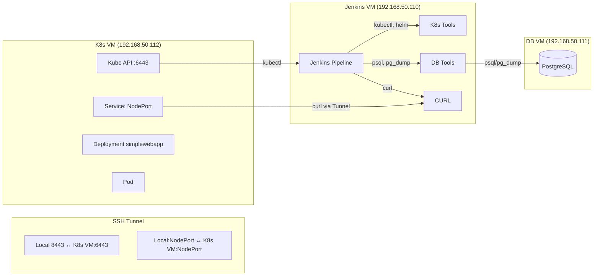

# 🚀 Jenkins - Kubernetes Mock App Upgrade Pipeline

Automated **CI/CD upgrade pipeline** for a mock web app (**SimpleWebApp**) on Kubernetes with a **PostgreSQL backend**.  
This project demonstrates:
- ✅ Health checks
- 💾 Database backup & schema upgrade
- ⎈ Helm-based application deployment
- 📦 Artifact archiving

---

## 🏗️ Architecture Overview



---

## 📋 Prerequisites

You need **3 Virtual Machines**:

1. **Jenkins VM** 🧩
   - Jenkins controller/agent with label `jenkins-vm`
   - Installed tools: `kubectl`, `helm`, `psql`, `pg_dump`, `curl`

2. **Kubernetes VM** ⎈
   - Minikube cluster with **1 control-plane** + **1 worker node**
   - CNI installed (e.g., **Flannel**)

3. **PostgreSQL VM** 🗄️
   - PostgreSQL server configured to allow connections from Jenkins VM IP

4. **Networking** 🌐
   - All VMs must be on the same network segment, e.g. `192.168.50.0/24`

---

## ⚡ Quick Start

### 1️⃣ Environment Setup
Follow the detailed guide in `docs/ENVIRONMENT_SETUP.md` to:
- Prepare your VMs
- Deploy the **initial v1.0 state**

---

### 2️⃣ Repository Setup
```bash
git clone https://github.com/<your-username>/jenkins-k8s-mockapp.git
cd jenkins-k8s-mockapp
```

---

### 3️⃣ Configure Jenkins

🔑 **Create Credential**
- **Kind:** Secret text  
- **ID:** `cks-test-db-password`  
- **Secret:** `testpass`

📦 **Create Pipeline Job**
- New Item → **Pipeline**
- **Name:** `app-upgrade-pipeline`
- **Definition:** Pipeline script from SCM
- **SCM:** Git
- **Repository URL:** Your fork's URL
- **Script Path:** `Jenkinsfile`
- Save ✅

---

### 4️⃣ Run the Pipeline
1. Open the job → Click **Build with Parameters**
2. Verify parameters (**IPs, paths**) match your environment
3. Click **Build** ▶️

---

## 🔄 Pipeline Stages

1. **Prepare Environment** 📂
   - Creates directory structure for backups & health checks

2. **Pre-Flight** 🩺
   - Runs health check on **v1.0 app**
   - Takes `pg_dump` backup of DB

3. **Apply DB Schema** 🗄️
   - Executes `v2.0_upgrade.sql` to upgrade DB schema

4. **Helm Upgrade** ⎈
   - Deploys **v2.0 Helm chart**
   - Waits for rollout to complete

5. **Mock DTA Upgrade** 🔄
   - Runs mock script simulating **3rd-party integration update**

6. **Post-Upgrade Health Check** ✅
   - Verifies **v2.0 app** is healthy & serving correct content

---

✨ Now you have a **fully automated app upgrade pipeline** with database migration, Helm deployment, and health validation!
